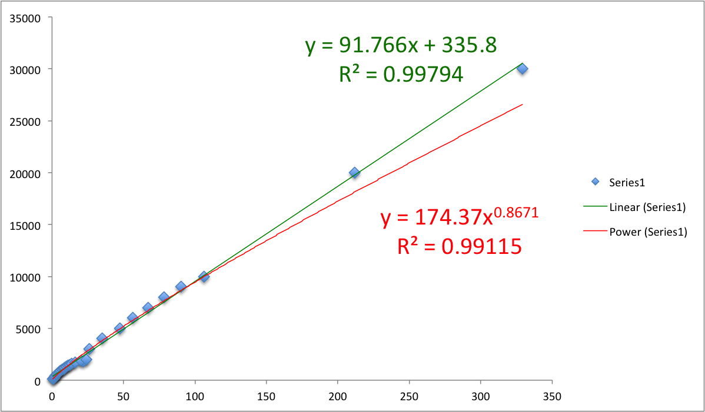

# Coding exercise - Prime tables 
### Node.js v0.12.0

## Introduction

Write an application that takes numeric input (N) from a user and outputs a multiplication table of (N) prime numbers.

## Install
`git clone https://github.com/Leo-ajc/prime_node.git`

`cd prime_node`

`npm install`

## Run 
`node ./src/cli.js 7`

`$ [ 2, 3, 5, 7, 11, 13, 17 ]`

## Run tests
`npm test`

## Benchmark
`node ./benchmark/benchmark.js`

### Dataset
`./benchmark/regression_worksheet.xlsx`

### Limit of the function

> n = 30
>
> O(n^c) Fractional Power
>
> y = 174.37x0.8671
>
> R^2 = 0.99115

> n = 30
>
> O(n) Linear
>
> y = 91.766x + 335.8
>
> R^2 = 0.99794

## I am pleased with
Able to implement a segmented sieve.

## Given more time I would:
1. Created an output multiplication table.
2. Used more functional syntax, map and reduce than iteration I used.
3. Removed the crazy code replication in the tests.

